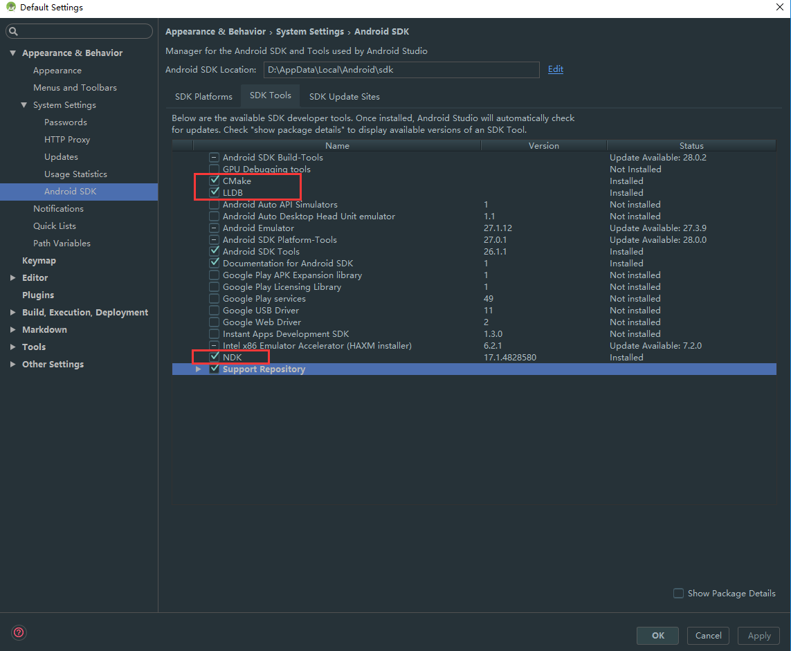
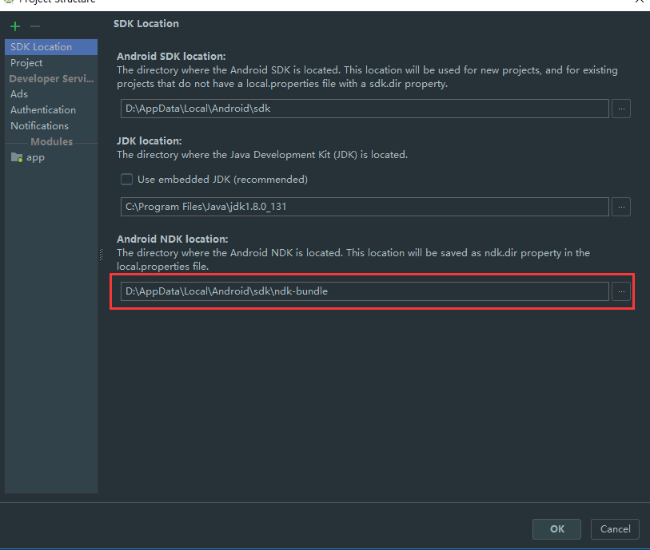
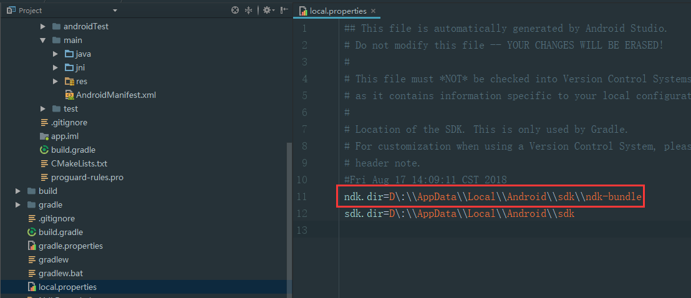
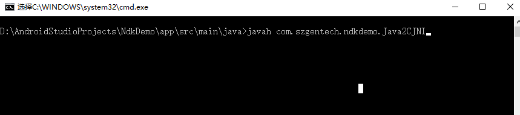
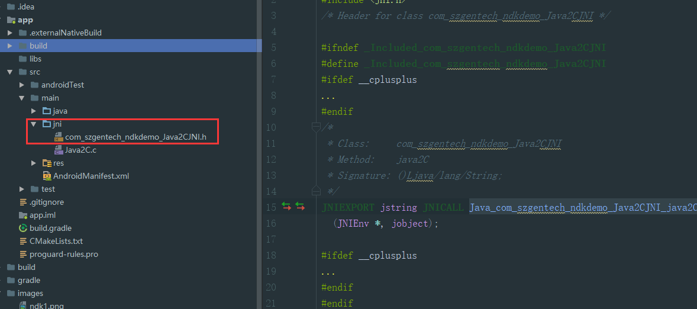
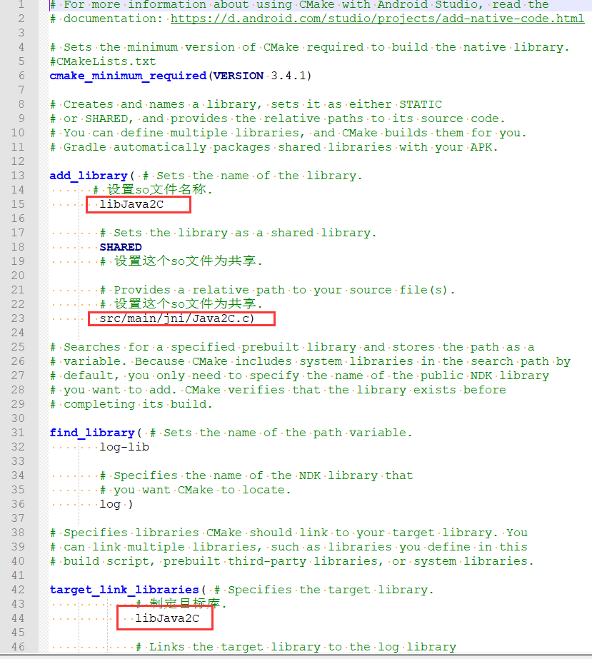
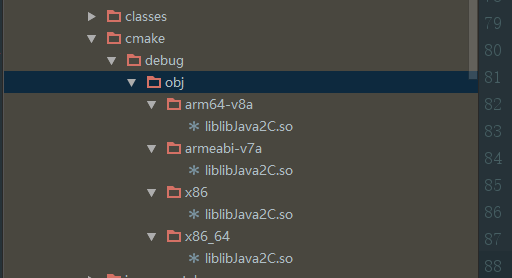
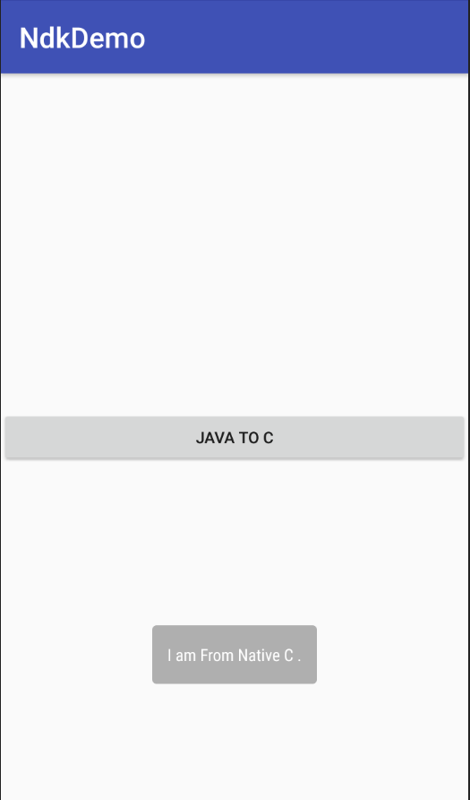

### 1、NDK的环境搭建

- 如下图所示，下NDK、LLDB、CMake 搭建NDK的开发环境



- 检查SDK Location里面的NDK路径：


- 检查local.properties文件里面有没有NDK路径



### 2、在MainActivity中获取该控件并注册它的点击监听器
```java
    private static final String TAG = MainActivity.class.getSimpleName();

    @Override
    protected void onCreate(Bundle savedInstanceState) {
        super.onCreate(savedInstanceState);
        setContentView(R.layout.activity_main);

        findViewById(R.id.btn_java2C).setOnClickListener(new View.OnClickListener() {
            @Override
            public void onClick(View v) {
                String result = new Java2CJNI().java2C();
                Log.d(TAG,result);
                Toast.makeText(MainActivity.this,result,Toast.LENGTH_LONG).show();
            }
        });
    }
```

### 3、创建Java2CJNI类及本地方法

```java
public class Java2CJNI {

    //加载so库
    static {
        System.loadLibrary("libJava2C");  //设置so文件名称
    }


    public native String java2C();

}

```

### 4、通过javah命令获取到本地头文件

在项目根目录下，进入main->java目录，全选文件目录栏，直接输入cmd命令并按回车键进入docs命令，在命令中执行javah com.sanhui.ndkdemo.Java2CJNI命令：
执行完javah命令后，在java当前目录下创建一个.h的头文件，



### 5、创建**jni**文件夹并把.h文件放到**jni**文件夹中



### 6、 创建实现头文件的.C源文件
在jni目录下创建一个Java2C.c的源文件
```objectivec
#include "com_szgentech_ndkdemo_Java2CJNI.h"
JNIEXPORT jstring JNICALL Java_com_szgentech_ndkdemo_Java2CJNI_java2C(JNIEnv *env,jobject instance){

    return (*env) -> NewStringUTF(env,"I am From Native C .");
}


```


### 7、在项目的模块的build.gradle
- 在defaultConfig节点配置生成的so名称和支持的cpu类型
```groovy
   ndk {
            moduleName "libJava2C" //so文件名
            abiFilters 'arm64-v8a','armeabi-v7a','x86','x86_64' //CPU类型
        }
```
- 在android节点配置
```groovy
    externalNativeBuild {
        cmake {
            path "CMakeLists.txt" //编译后so文件的名字
        }
    }
```

- 添加CMakeLists.txt文件到build.gradle文件同级目录下

```text
# For more information about using CMake with Android Studio, read the
# documentation: https://d.android.com/studio/projects/add-native-code.html

# Sets the minimum version of CMake required to build the native library.
#CMakeLists.txt
cmake_minimum_required(VERSION 3.4.1)

# Creates and names a library, sets it as either STATIC
# or SHARED, and provides the relative paths to its source code.
# You can define multiple libraries, and CMake builds them for you.
# Gradle automatically packages shared libraries with your APK.

add_library( # Sets the name of the library.
      # 设置so文件名称.
       libJava2C

       # Sets the library as a shared library.
       SHARED
       # 设置这个so文件为共享.

       # Provides a relative path to your source file(s).
       # 设置这个so文件为共享.
       src/main/jni/Java2C.c)

# Searches for a specified prebuilt library and stores the path as a
# variable. Because CMake includes system libraries in the search path by
# default, you only need to specify the name of the public NDK library
# you want to add. CMake verifies that the library exists before
# completing its build.

find_library( # Sets the name of the path variable.
       log-lib

       # Specifies the name of the NDK library that
       # you want CMake to locate.
       log )

# Specifies libraries CMake should link to your target library. You
# can link multiple libraries, such as libraries you define in this
# build script, prebuilt third-party libraries, or system libraries.

target_link_libraries( # Specifies the target library.
            # 制定目标库.
            libJava2C

            # Links the target library to the log library
            # included in the NDK.
            ${log-lib} )
```



### 8、生成so文件
在项目的工具类中选择Build->Rebuild Project，进行重新编译工程，然后AS会为我们生成so文件，so文件所在目录为：app/build/intermediates/cmake/debug/obj下



### 9、运行


